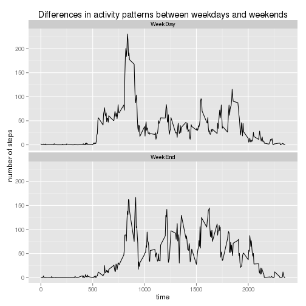

## Loading and preprocessing the data

Note: preprocessing not persofrmed here. Further improvements: for time intervals, colon can be introduced, i.e. "0" => "00:00", "5" => "00:05", 835 => "8:35", "2355" => "23:55" and so on.

```r
suppressPackageStartupMessages(library(sqldf));
suppressPackageStartupMessages(library(tcltk));
library(chron);
options(scipen = 6, digits = 2)

if (!exists("rawData")){
    rawData <- read.csv("activity.csv");
}
```


## What is mean total number of steps taken per day?

```r
r1 <- sqldf("select date, sum(steps) as sum_steps 
            from rawData 
            where steps IS NOT NULL 
            group by date");
r1mean <- mean(r1$sum_steps);
r1median <- median(r1$sum_steps);
hist(r1$sum_steps, xlab = "number of steps", main = "total number of steps per day");
```

 
NA values were ignored. So, mean and median of the total number of steps taken per day are 10766.19 and 10765 accordingly.


## What is the average daily activity pattern?

```r
dailyPattern <- sqldf("select interval, avg(steps) as avg_steps 
            from rawData 
            where steps IS NOT NULL 
            group by interval
            order by interval asc");
maxStepsIndex <- which.max(dailyPattern$avg_steps);
maxStepsInterval <- dailyPattern$interval[maxStepsIndex];
plot(dailyPattern$interval, dailyPattern$avg_steps, ylab = "number of steps", xlab = "time", main ="average number of steps per 5-minute interval within a day", type = "l");
```

 
Most "active" interval within a day (i.e. contains the maximum number of steps) is 835


## Imputing missing values
NA values are imputed using average daily pattern(since mean/media for the day is too rough)

```r
na_count <- sum(is.na(rawData$steps));
alteredData <- read.csv("activity.csv");
rowLimit <- nrow(alteredData);
for (i in 1:rowLimit){
    if (is.na(alteredData$steps[i])){
        alteredData$steps[i] <- dailyPattern$avg_steps[ alteredData$interval[i] == dailyPattern$interval ];
    }
}

alteredDailySteps <- sqldf("select date, sum(steps) as sum_steps 
            from alteredData 
            group by date");

alteredMean <- mean(alteredDailySteps$sum_steps);
alteredMedian <- median(alteredDailySteps$sum_steps);
hist(alteredDailySteps$sum_steps, xlab = "number of steps", main = "total number of steps per day");
```

 
Now mean and median of the total number of steps taken per day are 10766.19 and 10766.19 accordingly. Values are almost the same (compared to step 2, "What is the average daily activity pattern") since NA values were imputed using average daily pattern.

## Are there differences in activity patterns between weekdays and weekends?

```r
alteredData$isWeekday <- factor(ifelse(weekdays(as.POSIXct(strftime(alteredData$date, format = "%Y-%m-%e"))) %in% c("Saturday", "Sunday"), "WeekEnd", "WeekDay"));


alteredDailyPattern <- sqldf("select interval, isWeekday, avg(steps) as avg_steps
            from alteredData 
            where steps IS NOT NULL 
            group by interval, isWeekday
            order by interval asc");

library(ggplot2);
ggplot(alteredDailyPattern, 
       aes(interval, avg_steps) ) + 
    geom_line() + 
    facet_wrap(~ isWeekday, ncol = 1) + 
    xlab("time") + 
    ylab("number of steps") + 
    ggtitle("Differences in activity patterns between weekdays and weekends")
```

 

Interesting to see, for WeekDays there is a splash at "5:00". WeekEnds have no such splash.
